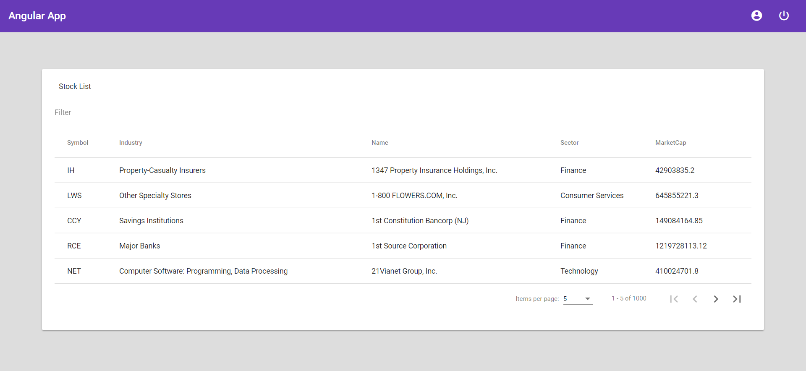

## Quick Overview

Make sure to have nodejs 10.4 installed

```sh
cd Flutura
npm install
cd server
npm install
cd ..
npm start
```

This starts up the app and can be viewed on http://localhost:4200/ 

Initial Screen:

<p align='center'>

</p>

Initial  Assumption:
The Excel File has been dumped to SQLite Db and is found on server/db/stockAPI.db

## Brief Explanation of Code

* This application is setup with angular and themed in angular material UI on frontend side
* On the backend side, the APIs are setup with nodejs, express JS and SQLite3 for the database
* All Client related code sits in src folder
* UI has a simple header component and BodyArea Component which consists of Table
* Data.Service.ts has the fetch API and fetches stock data
* Now the data is loaded into the table component 
* On Server Side, Node JS and Express JS is used for hosting the APIs and sql.js package is used for connecting to database
* On server startup, it reads sqliteDB file one time
* In Server folder/server.js, API is written for fetching the data from DB